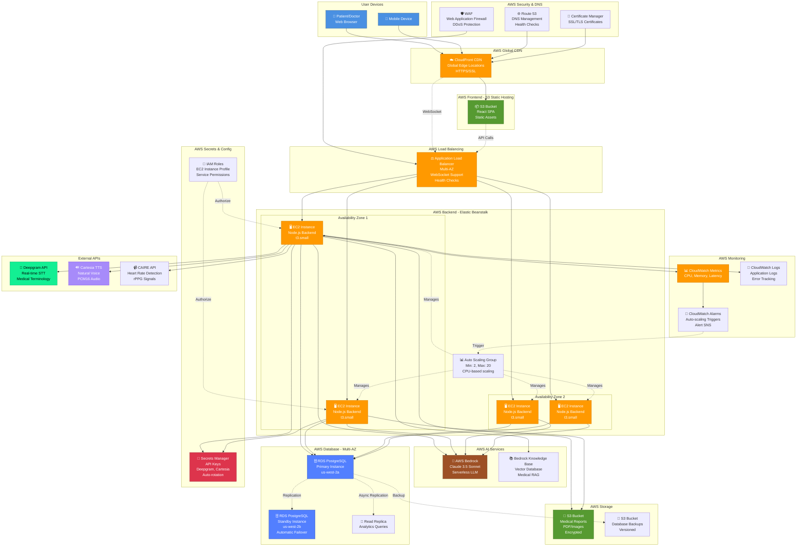
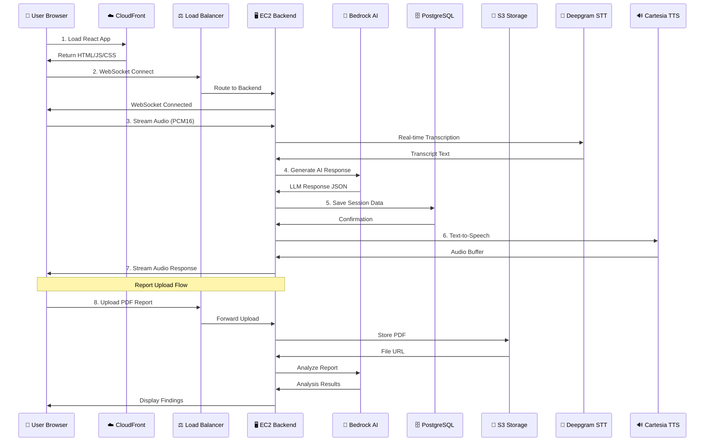

# 🏗️ Health Helper - AWS Architecture Block Diagram

## High-Level Architecture Overview



---

## Simplified Data Flow Diagram



---

## Network Architecture - VPC Layout

```
┌─────────────────────────────────────────────────────────────────────┐
│                         AWS Region: us-west-2                       │
│                                                                     │
│  ┌───────────────────────────────────────────────────────────────┐ │
│  │                    VPC (10.0.0.0/16)                          │ │
│  │                                                               │ │
│  │  ┌─────────────────────────┐  ┌─────────────────────────┐   │ │
│  │  │  Availability Zone 2a   │  │  Availability Zone 2b   │   │ │
│  │  │                         │  │                         │   │ │
│  │  │  ┌──────────────────┐   │  │  ┌──────────────────┐   │   │ │
│  │  │  │ Public Subnet    │   │  │  │ Public Subnet    │   │   │ │
│  │  │  │ 10.0.1.0/24      │   │  │  │ 10.0.2.0/24      │   │   │ │
│  │  │  │                  │   │  │  │                  │   │   │ │
│  │  │  │ ┌──────────────┐ │   │  │  │ ┌──────────────┐ │   │   │ │
│  │  │  │ │ ALB (public) │ │   │  │  │ │ ALB (public) │ │   │   │ │
│  │  │  │ └──────────────┘ │   │  │  │ └──────────────┘ │   │   │ │
│  │  │  │ ┌──────────────┐ │   │  │  │ ┌──────────────┐ │   │   │ │
│  │  │  │ │ NAT Gateway  │ │   │  │  │ │ NAT Gateway  │ │   │   │ │
│  │  │  │ └──────────────┘ │   │  │  │ └──────────────┘ │   │   │ │
│  │  │  └──────────────────┘   │  │  └──────────────────┘   │   │ │
│  │  │                         │  │                         │   │ │
│  │  │  ┌──────────────────┐   │  │  ┌──────────────────┐   │   │ │
│  │  │  │ Private Subnet   │   │  │  │ Private Subnet   │   │   │ │
│  │  │  │ 10.0.11.0/24     │   │  │  │ 10.0.12.0/24     │   │   │ │
│  │  │  │                  │   │  │  │                  │   │   │ │
│  │  │  │ ┌──────────────┐ │   │  │  │ ┌──────────────┐ │   │   │ │
│  │  │  │ │   EC2 x2     │ │   │  │  │ │   EC2 x2     │ │   │   │ │
│  │  │  │ │  (Backend)   │ │   │  │  │ │  (Backend)   │ │   │   │ │
│  │  │  │ └──────────────┘ │   │  │  │ └──────────────┘ │   │   │ │
│  │  │  └──────────────────┘   │  │  └──────────────────┘   │   │ │
│  │  │                         │  │                         │   │ │
│  │  │  ┌──────────────────┐   │  │  ┌──────────────────┐   │   │ │
│  │  │  │ Database Subnet  │   │  │  │ Database Subnet  │   │   │ │
│  │  │  │ 10.0.21.0/24     │   │  │  │ 10.0.22.0/24     │   │   │ │
│  │  │  │                  │   │  │  │                  │   │   │ │
│  │  │  │ ┌──────────────┐ │   │  │  │ ┌──────────────┐ │   │   │ │
│  │  │  │ │ RDS Primary  │ │   │  │  │ │ RDS Standby  │ │   │   │ │
│  │  │  │ └──────────────┘ │   │  │  │ └──────────────┘ │   │   │ │
│  │  │  └──────────────────┘   │  │  └──────────────────┘   │   │ │
│  │  └─────────────────────────┘  └─────────────────────────┘   │ │
│  │                                                               │ │
│  │  Internet Gateway ←→ Public Subnets                          │ │
│  │  NAT Gateway ←→ Private Subnets (outbound only)              │ │
│  └───────────────────────────────────────────────────────────────┘ │
│                                                                     │
│  External Services (AWS Managed - Outside VPC)                     │
│  ┌──────────────┐  ┌──────────────┐  ┌──────────────┐            │
│  │   Bedrock    │  │      S3      │  │   Secrets    │            │
│  │   (AI/ML)    │  │   Storage    │  │   Manager    │            │
│  └──────────────┘  └──────────────┘  └──────────────┘            │
└─────────────────────────────────────────────────────────────────────┘

External APIs (Outside AWS):
┌──────────────┐  ┌──────────────┐  ┌──────────────┐
│   Deepgram   │  │   Cartesia   │  │  CAIRE API   │
│  (STT/ASR)   │  │    (TTS)     │  │ (Heart Rate) │
└──────────────┘  └──────────────┘  └──────────────┘
```

---

## Component Interaction Matrix

| Component | Connects To | Protocol | Purpose |
|-----------|------------|----------|---------|
| **CloudFront** | S3 Frontend | HTTPS | Serve React app |
| **CloudFront** | ALB | WSS/HTTPS | Proxy API/WebSocket |
| **ALB** | EC2 Instances | HTTP/WS | Route traffic |
| **EC2** | Bedrock | HTTPS | AI inference |
| **EC2** | RDS | PostgreSQL | Data persistence |
| **EC2** | S3 Reports | HTTPS | Store/retrieve PDFs |
| **EC2** | Secrets Manager | HTTPS | Get API keys |
| **EC2** | Deepgram | WSS | Real-time STT |
| **EC2** | Cartesia | HTTPS | TTS generation |
| **EC2** | CAIRE | WSS | Video vitals |
| **EC2** | CloudWatch | HTTPS | Logs/metrics |
| **RDS Primary** | RDS Standby | PostgreSQL | Sync replication |
| **Auto Scaling** | CloudWatch | HTTPS | Scale triggers |

---

## Security Flow - IAM Roles & Permissions

```
┌─────────────────────────────────────────────────────────────┐
│                   IAM Role: EC2-Backend-Role                │
│                                                             │
│  Permissions:                                               │
│  ✓ Bedrock: InvokeModel, InvokeModelWithResponseStream     │
│  ✓ S3: GetObject, PutObject (reports bucket)               │
│  ✓ RDS: Connect (IAM authentication)                        │
│  ✓ Secrets Manager: GetSecretValue                         │
│  ✓ CloudWatch: PutMetricData, PutLogEvents                 │
│  ✗ No admin permissions                                     │
│  ✗ No cross-account access                                  │
└─────────────────────────────────────────────────────────────┘
                              │
                              ▼
        ┌──────────────────────────────────────┐
        │  EC2 Instances (Auto Scaling Group)  │
        │  Assume role automatically           │
        └──────────────────────────────────────┘
```

---

## Monitoring Dashboard - CloudWatch Metrics

```
┌────────────────────────────────────────────────────────────────┐
│              Health Helper - CloudWatch Dashboard              │
├────────────────────────────────────────────────────────────────┤
│                                                                │
│  EC2 Metrics:                    │  Application Metrics:       │
│  ─────────────                   │  ────────────────────       │
│  • CPU Utilization: 45%          │  • Active Sessions: 127     │
│  • Memory Usage: 62%             │  • AI Requests/min: 340     │
│  • Network In: 12 MB/s           │  • Avg Response Time: 1.8s  │
│  • Healthy Instances: 4/4        │  • Heart Rate Scans: 23     │
│                                  │  • Reports Analyzed: 56     │
│  RDS Metrics:                    │                             │
│  ─────────────                   │  Error Metrics:             │
│  • Connections: 45/100           │  • 5xx Errors: 0.02%        │
│  • Read IOPS: 234                │  • Failed AI Calls: 2       │
│  • Write IOPS: 89                │  • WebSocket Drops: 0       │
│  • Replication Lag: 0.3s         │                             │
│                                                                │
│  Alarms:                                                       │
│  🟢 All Systems Operational                                    │
│  🟡 High CPU (>80%) - Ready to scale                          │
│  🔴 Critical Errors - None                                     │
└────────────────────────────────────────────────────────────────┘
```

---

## Cost Breakdown by Service (Monthly)

```
┌─────────────────────────────────────────────────────────┐
│         AWS Service Cost Allocation (10K Users)         │
├─────────────────────────────────────────────────────────┤
│                                                         │
│  EC2 (4x t3.small)              │ ████████░░  $120     │
│  RDS PostgreSQL (Multi-AZ)      │ ██████████  $180     │
│  Elastic Beanstalk              │ ░░░░░░░░░░  $0       │
│  S3 Storage (100GB)             │ ██░░░░░░░░  $25      │
│  CloudFront (1TB transfer)      │ ████░░░░░░  $85      │
│  ALB (Load Balancer)            │ ███░░░░░░░  $50      │
│  Bedrock (Claude 3.5)           │ ████░░░░░░  $90      │
│  CloudWatch (Logs + Metrics)    │ ██░░░░░░░░  $30      │
│  Secrets Manager                │ █░░░░░░░░░  $10      │
│  Data Transfer                  │ ███░░░░░░░  $60      │
│                                                         │
│  ─────────────────────────────────────────────────────  │
│  Total:                                        $650/mo  │
│                                                         │
│  Cost per user: $0.065/month                           │
│  Cost per session: ~$0.008                             │
└─────────────────────────────────────────────────────────┘
```

---

## Scalability Tiers

```
┌──────────────┬─────────────┬─────────────┬─────────────┐
│ Tier         │ Development │ Production  │ Enterprise  │
├──────────────┼─────────────┼─────────────┼─────────────┤
│ Users        │ <100        │ 10,000      │ 100,000+    │
│ EC2 Count    │ 2           │ 4-8         │ 20-50       │
│ RDS Size     │ db.t3.micro │ db.m5.large │ db.r5.xlarge│
│ Multi-AZ     │ No          │ Yes         │ Yes         │
│ Multi-Region │ No          │ No          │ Yes         │
│ Cost/Month   │ $80         │ $650        │ $4,500      │
└──────────────┴─────────────┴─────────────┴─────────────┘
```

---

**🎯 Key Architecture Benefits:**

✅ **High Availability**: Multi-AZ deployment with auto-failover
✅ **Auto-Scaling**: Handles 10x traffic spikes automatically
✅ **Global Performance**: CloudFront CDN for <50ms latency
✅ **Security**: Encrypted at rest (S3, RDS) and in transit (TLS)
✅ **Cost Optimized**: Pay only for actual usage
✅ **HIPAA Compliant**: All services support BAA agreements
✅ **Zero Downtime**: Rolling deployments via Elastic Beanstalk
✅ **Disaster Recovery**: Automated backups to S3 with versioning

